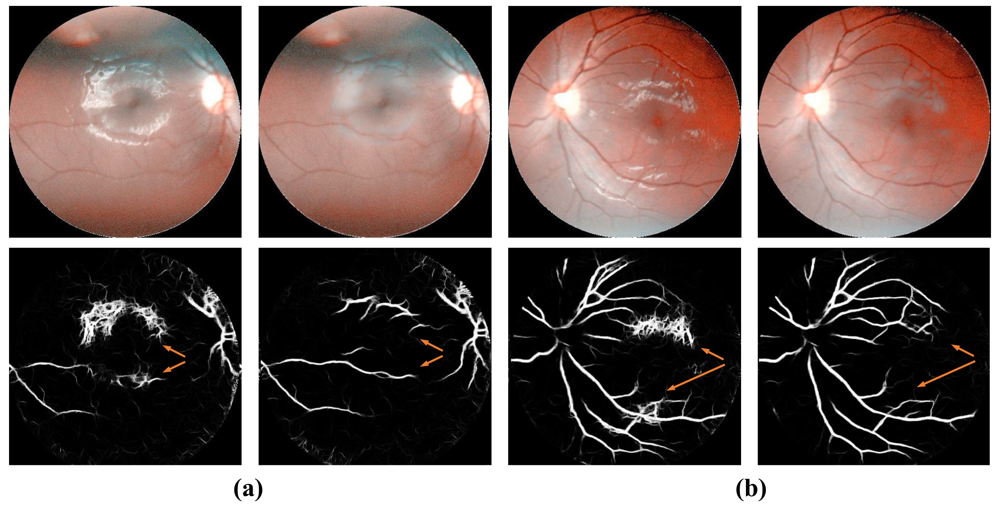

# Vessel Preservation Based Reflection Removal in Fundus Images

Lihua Ding，Xingzheng lv(Mule)，Shuchang Xu

Pytorch implementation of VPRR.

## Paper

Vessel Preservation Based Reflection Removal in Fundus Images

<p align="center">
  
</p>

## Reflection Removal Algorithm in Fundus images

Fundus images play a crucial role in diagnosing diseases like diabetic retinopathy (DR) and glaucoma. The quality of these images significantly impacts subsequent tasks. However, some equipment may produce low-quality fundus images with reflective areas caused by neuronal reflections. This study aims to improve fundus image quality by removing reflections. To address the challenge of the absence of ground truth data, a pseudo reflection generation algorithm is introduced to create paired data for training. Moreover, we introduce a reflection removal model that efficiently eliminates reflective regions while preserving the integrity of vascular structures in the fundus images. To address potential vascular degradation during the process of reflection removal, a vascular loss function is proposed to mitigate this issue. Our model shows promising results on both our dataset and the public datasets. We also demonstrate the applicability of this approach to downstream tasks such as vascular segmentation.

<p align="center">
  
</p>

## Installation

* Install Pytorch 1.13.0 and CUDA 11.7
* Clone this repo

```
git clone https://github.com/Alen880/VPRR-main
cd CANet
```

## Data Preparation

* Prepare a set of fundus images exhibiting reflections.
* Put the data under `./datasets/`


## Train

* Download [pretrain model](https://pan.baidu.com/s/1VN2JJfOZBc3vGOBsZRXoow)(code:s7y2) and put it under `./ckpt/`
* Run `sh training.sh` to start the training process

## Evaluate

* Specify the model path in `testing.sh`
* Run `sh testing.sh` to start the evaluation.


## Citation

If you find the code useful for your research, please cite our paper.

## Contact

If you have any questions, please contact dlh1964980767@163.com

## Acknowledgments

Our code architecture is inspired by [Zhu et al.](https://openaccess.thecvf.com/content/CVPR2024/html/Zhu_Revisiting_Single_Image_Reflection_Removal_In_the_Wild_CVPR_2024_paper.html).
